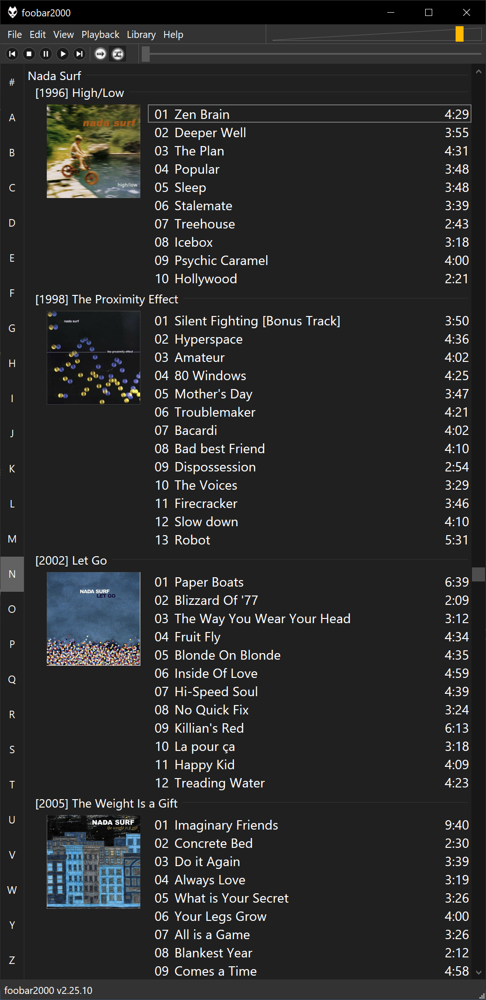
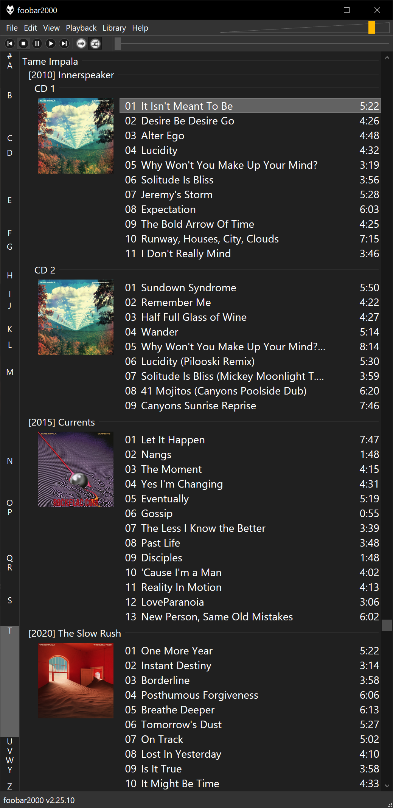
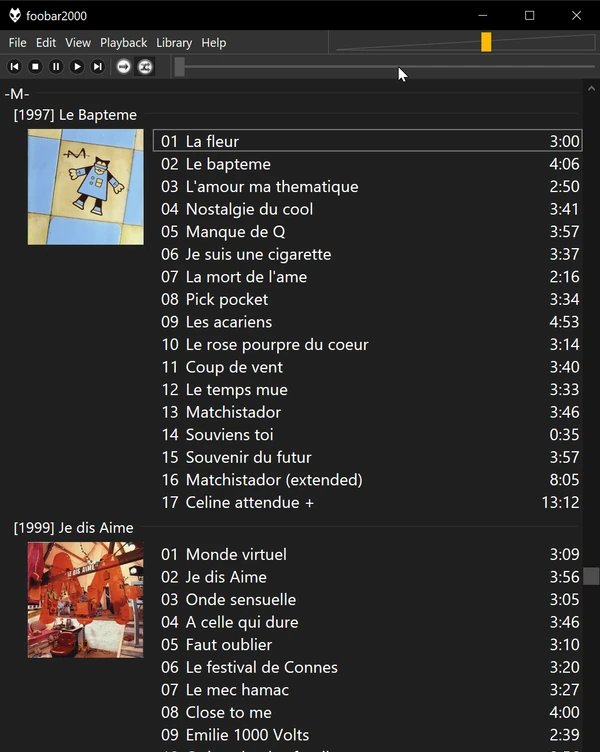

# foo_alphabar

A Columns UI panel for [foobar2000](https://www.foobar2000.org/) that draws an
alphabet strip (`#`, `A`–`Z`) next to the playlist. Click a letter to jump to
the first `%album artist%` starting with it; the highlight follows scrolling.

<p>
  
  
</p>

## Requirements

foobar2000 v2, Columns UI, and a playlist sorted by `%album artist%`.

## Install

Download `foo_alphabar.fb2k-component` from the
[releases](https://github.com/MBach/foo_alphabar/releases) and open it. Then add
**Alphabar** beside the playlist, about 25 px wide: turn on _View → Layout →
Live editing_, right-click the playlist and choose _Add before → Panels →
Alphabar_. Drag the splitter to narrow it, then turn live editing off.



_Preferences → Display → Alphabar_ chooses whether letters with no album artist
are shown dimmed or hidden. It can also size each letter by its number of
tracks, so the strip mirrors the playlist like a scrollbar: empty letters are
then hidden, and every letter keeps a readable minimum height.

## Notes

- Accented initials fold onto their base letter (É → E). Leading articles are
  not stripped, to match a sort on raw `%album artist%`.
- Leading hyphens, dashes and apostrophes are skipped, as Windows sorting
  ignores them: `-M-` files under M, `'Til Tuesday` under T.
- The last letters may not reach the top of the view, as it stops scrolling at
  the end of the list; there the highlight shows the last of them.
- Colours follow Columns UI, including dark mode, but are not configurable.

## Build

Visual Studio 2022 (toolset v143) and a Windows 10/11 SDK. The foobar2000 and
Columns UI SDKs are vendored under `sdk/`.

Run from `cmd` with foobar2000 closed, as a post-build step copies the DLL into
the foobar2000 profile. The path is for the Community edition; in the
_Developer Command Prompt for VS 2022_, plain `msbuild` works too.

```bat
set MSBUILD="C:\Program Files\Microsoft Visual Studio\2022\Community\MSBuild\Current\Bin\amd64\MSBuild.exe"
%MSBUILD% foo_alphabar.sln -t:Rebuild -p:Configuration=Release -p:Platform=x64 -m
%MSBUILD% foo_alphabar.sln -t:Rebuild -p:Configuration=Release -p:Platform=Win32 -m
```

Then package both into `build\foo_alphabar.fb2k-component`, a zip with the
Win32 DLL at the root and the x64 one under `x64/`:

```bat
powershell -NoProfile -Command "Add-Type -A System.IO.Compression.FileSystem; $p='build\foo_alphabar.fb2k-component'; if (Test-Path $p) { del $p }; $z=[IO.Compression.ZipFile]::Open($p,'Create'); [IO.Compression.ZipFileExtensions]::CreateEntryFromFile($z,'build\Win32\Release\foo_alphabar.dll','foo_alphabar.dll') | Out-Null; [IO.Compression.ZipFileExtensions]::CreateEntryFromFile($z,'build\x64\Release\foo_alphabar.dll','x64/foo_alphabar.dll') | Out-Null; $z.Dispose()"
```

`Compress-Archive` would not do: in Windows PowerShell 5.1 it writes `x64\` with
a backslash, which foobar2000 does not read as a folder.

## Credits

Written with the help of [Claude](https://claude.com/claude-code), Anthropic's
AI coding assistant.

## Licence

MIT — see [LICENSE](LICENSE). The vendored SDKs keep their own licences.
